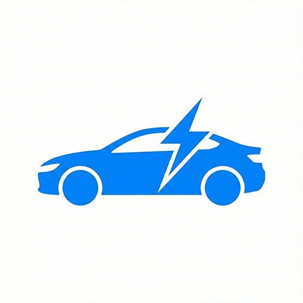

# ⚡ Autolys

**Katalog Mobil Masa Depan: Electric & Hybrid Vehicle Explorer**

Autolys adalah aplikasi web modern berbasis Progressive Web App (PWA) yang dirancang untuk membantu pengguna menemukan, membandingkan, dan menyimpan koleksi mobil listrik (EV) dan hybrid impian mereka. Aplikasi ini menawarkan pengalaman pengguna yang cepat, responsif, dan dapat berjalan secara offline.



URL: https://autolys.vercel.app/

## 🌟 Fitur Utama

* **Katalog Komprehensif:** Jelajahi 25+ koleksi mobil listrik murni (BEV) dan Hybrid (HEV/PHEV) dengan data terkini.
* **Pencarian & Filter Canggih:** Filter mobil berdasarkan merek, kategori teknologi, dan rentang harga (server-side filtering).
* **Autentikasi Pengguna:** Sistem Login dan Register aman menggunakan Supabase Auth.
* **Manajemen Favorit (Cloud):** Simpan mobil impian ke database cloud yang tersinkronisasi antar perangkat.
* **Admin Dashboard:** Halaman khusus untuk menambah, mengedit, dan menghapus data mobil (CRUD).
* **Multi-Bahasa:** Dukungan alih bahasa (Indonesia, Inggris, Jepang, Korea, Mandarin) menggunakan integrasi Google Translate.
* **Rekomendasi Sultan:** Halaman terkurasi untuk mobil-mobil high-end dengan harga di atas 1 Milyar.
* **PWA Ready:** Dapat diinstal di Smartphone (Android/iOS) dan Desktop, serta berfungsi dalam kondisi koneksi lambat.

## 🛠️ Teknologi yang Digunakan

Project ini dibangun menggunakan teknologi web modern:

* **Frontend:** [React 19](https://react.dev/)
* **Build Tool:** [Vite](https://vitejs.dev/)
* **Styling:** [Tailwind CSS v4](https://tailwindcss.com/)
* **Database:** [Supabase](https://supabase.com/)
* **Icons:** [Lucide React](https://lucide.dev/)
* **PWA:** [Vite Plugin PWA](https://vite-pwa-org.netlify.app/)

## 📱 Struktur Database

Aplikasi ini menggunakan dua tabel utama di Supabase:

* **cars:** Menyimpan data spesifikasi mobil, harga, dan gambar.
* **favorites:** Menyimpan relasi antara user ID dan mobil yang disukai.

## 🚀 Cara Menjalankan Project

Ikuti langkah-langkah berikut untuk menjalankan aplikasi di komputer lokal Anda.

#### 1. Prasyarat
* Node.js (v18 atau terbaru).
* Akun Supabase (untuk database)

#### 2. Setup Database (Supabase)
1. Buat proyek baru di Supabase.
2. Buka SQL Editor di dashboard Supabase.
3. Copy dan jalankan script SQL

```bash
-- 1. Membuat Tabel 'cars'
CREATE TABLE public.cars (
    id BIGINT GENERATED BY DEFAULT AS IDENTITY PRIMARY KEY,
    created_at TIMESTAMPTZ DEFAULT NOW(),
    name TEXT NOT NULL,
    brand TEXT NOT NULL,
    category TEXT NOT NULL, -- 'Electric' atau 'Hybrid'
    price TEXT NOT NULL, -- String tampilan, contoh: "Rp 850.000.000"
    price_value BIGINT NOT NULL, -- Angka murni untuk sorting/filter, contoh: 850000000
    engine TEXT,
    horsepower TEXT,
    image_url TEXT,
    description TEXT,
    is_featured BOOLEAN DEFAULT FALSE
);

-- 2. Membuat Tabel 'favorites' (Relasi ke users dan cars)
CREATE TABLE public.favorites (
    id BIGINT GENERATED BY DEFAULT AS IDENTITY PRIMARY KEY,
    created_at TIMESTAMPTZ DEFAULT NOW(),
    user_identifier UUID NOT NULL REFERENCES auth.users(id) ON DELETE CASCADE,
    car_id BIGINT NOT NULL REFERENCES public.cars(id) ON DELETE CASCADE,
    UNIQUE(user_identifier, car_id) -- Mencegah duplikasi favorit
);

-- 3. Mengaktifkan Row Level Security (RLS)
ALTER TABLE public.cars ENABLE ROW LEVEL SECURITY;
ALTER TABLE public.favorites ENABLE ROW LEVEL SECURITY;

-- 4. Membuat Kebijakan Keamanan (Policies)

-- Policy untuk CARS:
-- Semua orang (termasuk anonim) bisa MELIHAT (SELECT) data mobil
CREATE POLICY "Enable read access for all users" 
ON public.cars FOR SELECT 
USING (true);

-- Hanya user yang login bisa MENAMBAH/MENGUBAH/MENGHAPUS data mobil (Untuk Admin/Manager)
CREATE POLICY "Enable insert for authenticated users only" 
ON public.cars FOR INSERT 
TO authenticated 
WITH CHECK (true);

CREATE POLICY "Enable update for authenticated users only" 
ON public.cars FOR UPDATE 
TO authenticated 
USING (true);

CREATE POLICY "Enable delete for authenticated users only" 
ON public.cars FOR DELETE 
TO authenticated 
USING (true);

-- Policy untuk FAVORITES:
-- User hanya bisa melihat favorit mereka sendiri
CREATE POLICY "Users can view their own favorites" 
ON public.favorites FOR SELECT 
TO authenticated 
USING (auth.uid() = user_identifier);

-- User hanya bisa menambah favorit untuk diri sendiri
CREATE POLICY "Users can insert their own favorites" 
ON public.favorites FOR INSERT 
TO authenticated 
WITH CHECK (auth.uid() = user_identifier);

-- User hanya bisa menghapus favorit mereka sendiri
CREATE POLICY "Users can delete their own favorites" 
ON public.favorites FOR DELETE 
TO authenticated 
USING (auth.uid() = user_identifier);

-- Insert Data Mobil
INSERT INTO public.cars (id, name, brand, category, price, price_value, engine, horsepower, image_url, description, is_featured)
VALUES 
(1, 'Hyundai Ioniq 5', 'Hyundai', 'Electric', 'Rp 850.000.000', 850000000, 'Electric Motor', '217 HP', 'https://www.hyundai.com/content/dam/hyundai/id/id/images/local/ioniq5/id/hightlight/ioniq5-banner-d-1920X1080.jpg', 'Mobil listrik futuristik dengan fitur V2L dan desain retro-modern yang ikonik.', true),

(2, 'Wuling Air EV Long Range', 'Wuling', 'Electric', 'Rp 299.500.000', 299500000, 'Electric Motor', '40 HP', 'https://arista-group.co.id/wp-content/uploads/2023/07/Air-EV-Long-Range-Pristine-White.webp', 'Solusi mobilitas perkotaan yang praktis, hemat energi, dan mudah diparkir.', false),

(3, 'Toyota Innova Zenix Hybrid', 'Toyota', 'Hybrid', 'Rp 611.000.000', 611000000, '2.0L Hybrid System', '186 HP', 'https://images.prod.seva.id/Toyota/All%20New%20Kijang%20Innova%20Zenix/main_color/Zenix_main_black_transparent.png', 'MPV keluarga legendaris kini hadir dengan teknologi hybrid yang jauh lebih efisien.', true),

(4, 'Tesla Model 3 Highland', 'Tesla', 'Electric', 'Rp 1.500.000.000', 1500000000, 'Electric Motor', '283 HP', 'https://tsportline.com/cdn/shop/articles/updated-tesla-model-3-front-three-quarters-1_1920x.webp?v=1693585311', 'Sedan listrik paling populer dengan facelift terbaru, interior minimalis, dan jarak tempuh impresif.', true),

(5, 'Lexus RX 350h Luxury', 'Lexus', 'Hybrid', 'Rp 1.700.000.000', 1700000000, '2.5L Hybrid', '246 HP', 'https://www.lexus.co.id/content/dam/lexus-v3-blueprint/models/suv/rx/rx-350h/my23/gallery/exterior/cgi/gallery-ext-04-d.jpg', 'SUV mewah yang menawarkan kenyamanan kabin kelas satu dan keheningan mesin hybrid.', false),

(6, 'Hyundai Ioniq 6', 'Hyundai', 'Electric', 'Rp 1.220.000.000', 1220000000, 'Dual Motor AWD', '320 HP', 'https://www.hyundai.com/content/dam/hyundai/id/id/images/local/ioniq6/KV_Ionic-6_D_Home-Banner_1860x720.png', 'Electrified Streamliner dengan aerodinamika luar biasa untuk efisiensi maksimal.', false),

(7, 'BMW iX xDrive40', 'BMW', 'Electric', 'Rp 2.488.000.000', 2488000000, 'Dual Electric Motor', '326 HP', 'https://ev-database.org/img/auto/BMW_iX_2022/BMW_iX_2022-01@2x.jpg', 'SUV listrik flagship BMW dengan desain interior lounge yang sangat mewah dan material daur ulang.', true),

(8, 'MG 4 EV', 'MG', 'Electric', 'Rp 429.000.000', 429000000, 'RWD Electric Motor', '170 HP', 'https://www.mg-mobil.com/file/20241102224312_m.jpeg', 'Hatchback listrik dengan handling fun-to-drive berkat penggerak roda belakang (RWD).', false),

(9, 'Toyota bZ4X', 'Toyota', 'Electric', 'Rp 1.190.000.000', 1190000000, 'Electric Motor', '204 HP', 'https://preview.thenewsmarket.com/Previews/NCAP/StillAssets/1920x1080/677808_v2.jpg', 'Langkah serius Toyota di segmen BEV dengan platform e-TNGA yang kokoh.', false),

(10, 'Nissan Kicks e-Power', 'Nissan', 'Hybrid', 'Rp 519.000.000', 519000000, 'e-Power System', '136 HP', 'https://storage.googleapis.com/prod-nissan-indonesia/3840_X_1975_Kicks_2022_Top_Banner_copy_2bdf7622f8/3840_X_1975_Kicks_2022_Top_Banner_copy_2bdf7622f8.jpg', 'Mobil listrik tanpa perlu charging. Mesin bensin hanya berfungsi sebagai generator baterai.', false),

(11, 'Honda CR-V e:HEV', 'Honda', 'Hybrid', 'Rp 814.000.000', 814000000, '2.0L Hybrid', '207 HP', 'https://res.cloudinary.com/mufautoshow/image/upload/f_auto,f_auto/w_1200/v1694656071/moas/news/1694656048_all-new-crv-20l-rs-ehev-suv-premium-bermesin-hybrid.png', 'SUV premium dengan sistem hybrid canggih yang bertenaga namun tetap irit.', false),

(12, 'Chery Omoda E5', 'Chery', 'Electric', 'Rp 498.000.000', 498000000, 'Electric Motor', '204 HP', 'https://cheryidn.sgp1.cdn.digitaloceanspaces.com/prod/product-models/omoda/product-types/omoda-e5/E5-new-banner-desktop-latest.png', 'Desain futuristik dengan performa akselerasi instan dan fitur ADAS lengkap.', false),

(13, 'Kia EV9 GT-Line', 'Kia', 'Electric', 'Rp 1.975.000.000', 1975000000, 'Dual Motor AWD', '380 HP', 'https://i.gaw.to/content/photos/60/15/601552-kia-ev9-gt-line-2024.jpeg', 'SUV listrik bongsor 3 baris dengan desain kotak yang gagah dan fitur super canggih.', false),

(14, 'Porsche Taycan', 'Porsche', 'Electric', 'Rp 2.900.000.000', 2900000000, 'Electric Motor', '402 HP', 'https://cdn.motor1.com/images/mgl/pb4p8P/s1/2025-porsche-taycan.jpg', 'Sportscar listrik murni yang menawarkan sensasi berkendara khas Porsche tanpa emisi.', false),

(15, 'Mitsubishi Xpander HEV', 'Mitsubishi', 'Hybrid', 'Rp 360.000.000', 360000000, '1.6L Hybrid', '114 HP', 'https://www.mitsurma.com/wp-content/uploads/2024/02/xpandercrosshev-highlight-home-banner.jpg', 'MPV sejuta umat kini hadir dengan teknologi hybrid (rilis Thailand/Global).', false),

(16, 'Volvo XC90 Recharge', 'Volvo', 'Hybrid', 'Rp 1.800.000.000', 1800000000, 'T8 AWD Plug-in Hybrid', '462 HP', 'https://smartcdn.gprod.postmedia.digital/driving/wp-content/uploads/2024/01/2024-Volvo-XC90-Recharge-Review-Exterior-Front3Q1-scaled.jpg', 'SUV Swedia teraman dengan tenaga buas dari mesin Plug-in Hybrid.', false),

(17, 'BYD Seal Performance', 'BYD', 'Electric', 'Rp 719.000.000', 719000000, 'Dual Motor AWD', '523 HP', 'https://www.byd.com/content/dam/byd-site/en-ae/product/seal/pc/section01.jpg', 'Sedan sport listrik dengan akselerasi 0-100 km/jam dalam 3.8 detik.', false),

(18, 'Suzuki Grand Vitara', 'Suzuki', 'Hybrid', 'Rp 390.000.000', 390000000, 'Smart Hybrid', '102 HP', 'https://suzukicdn.com/uploads/news/grand-vitara-untuk-ciptakan-momen-libur-lebaran-yang-stylish.webp', 'SUV Compact dengan teknologi Mild Hybrid yang efisien untuk harian.', false),

(19, 'Toyota Alphard HEV', 'Toyota', 'Hybrid', 'Rp 1.680.000.000', 1680000000, '2.5L Hybrid', '250 HP', 'https://astraotoshop.com/asset/article-aop/alphard%202025_20250520.webp', 'Simbol kemewahan MPV di Indonesia, kini lebih senyap dan irit.', false),

(20, 'Mini Cooper SE', 'Mini', 'Electric', 'Rp 1.050.000.000', 1050000000, 'Electric Motor', '184 HP', 'https://ev-database.org/img/auto/Mini_Cooper_Electric_2024/Mini_Cooper_Electric_2024-01@2x.jpg', 'Gokart feeling khas Mini dalam paket elektrik yang ikonik dan stylish.', false),

(21, 'Neta V-II', 'Neta', 'Electric', 'Rp 299.000.000', 299000000, 'Electric Motor', '94 HP', 'https://arista-group.co.id/wp-content/uploads/2024/06/Neta-V-II-Milk-Tea.png', 'Crossover listrik entry-level dengan fitur lengkap dan harga terjangkau.', false),

(22, 'BMW i7 xDrive60', 'BMW', 'Electric', 'Rp 3.250.000.000', 3250000000, 'Dual Electric Motor', '544 HP', 'https://ev-database.org/img/auto/BMW_i7_2022/BMW_i7_2022-01@2x.jpg', 'Sedan ultra-luxury elektrik dengan layar bioskop theater screen di kabin belakang.', false),

(23, 'Mazda CX-60', 'Mazda', 'Hybrid', 'Rp 1.188.000.000', 1188000000, '3.3L Mild Hybrid', '280 HP', 'https://www.topgear.com/sites/default/files/2025/03/004-2025-Mazda-CX-60-e-Skyactiv-D-MHEV-Homura-Plus-action_highres.jpg', 'SUV premium RWD dengan mesin 6 silinder inline yang halus dan bertenaga.', false),

(24, 'Citroen e-C3', 'Citroen', 'Electric', 'Rp 377.000.000', 377000000, 'Electric Motor', '57 HP', 'https://www.topgear.com/sites/default/files/2025/04/1%20Citroen%20eC3%20review%202025%20UK_1.jpg', 'City car listrik bergaya Eropa yang mengutamakan kenyamanan suspensi.', false),

(25, 'Ferrari SF90 Stradale', 'Ferrari', 'Hybrid', 'Rp 18.000.000.000', 18000000000, 'V8 PHEV', '986 HP', 'https://cdn.motor1.com/images/mgl/qkk7zv/s3/novitec-ferrari-sf90-stradale-2022.jpg', 'Hypercar plug-in hybrid Ferrari paling bertenaga yang legal di jalan raya.', false);
```

4. Pergi ke Project Settings > API. Salin Project URL dan anon public key.

#### 3. Konfigurasi Environment

```bash
VITE_SUPABASE_URL=[URL Supabase Anda]
VITE_SUPABASE_ANON_KEY=[Anon Key Supabase Anda]
```

#### 4. Instalasi & Menjalankan
Buka terminal di folder proyek, lalu jalankan:

```bash
# Instal dependensi
npm install

# Jalankan server development
npm run dev
```

Akses aplikasi di http://localhost:5173.

#### 5. Instalasi & Menjalankan

Untuk menguji fitur PWA dan instalasi ke Home Screen:

```bash
# Jalankan perintah build
npm run build

# Instal serve secara global (jika belum)
npm install -g serve

# Jalankan folder hasil build
serve -s build
```

#### 6. Akses dari HP:
- Pastikan HP dan Laptop terhubung ke Wi-Fi yang sama.
- Buka browser di HP dan ketik alamat Network IP yang muncul di terminal.
- Anda akan melihat opsi untuk menginstal aplikasi Autolys.

© 2025 Autolys Project.